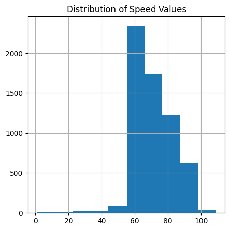
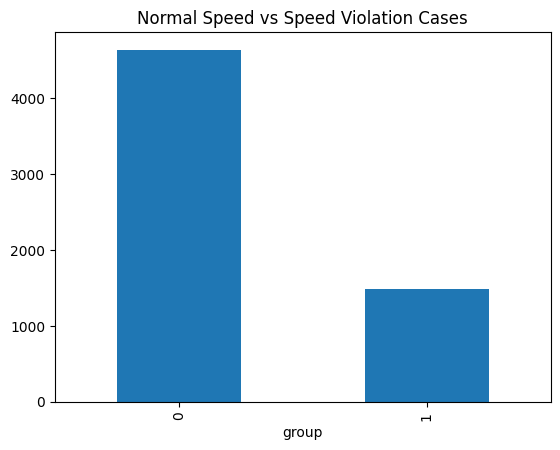

# Anomaly Detection in Sensor Readings for Vehicle Travel Speed Using Unsupervised Approaches

Originally developed: 2019

Updated and improved: 2026

Author:

Javaria Ahmad

Ph.D. in Computer Science (Data Science and Security)

---

## Project Goal

- Use anomaly detection models for finding anomalies in the traffic data set using unsupervised machine learning. 
- Anomalies in sensor data or the speeding violators are spotted. 
- Two approaches from sklearn are used: Isolation Forest and Local Outlier Factor. 
- The two approaches are compared for their performance.

---

## Data Explained

Real traffic speed sensor data is used from https://www.kaggle.com/boltzmannbrain/nab. This dataset contains speeds for vehicles captured by three different sensors.

---

## Data Preprocessing

- Three different sensor readings are loaded into dataframes and combined into one dataframe. 
- There are 6122 records and two columns: timestamp and speed value.
- First, replacing the missing values by nan and then dropping them.

---

## Exploratory Data Analysis

Observing statistics to understand the data:
- Value count is 6122
- Mean speeding value is ~71 mph
- Maximum value found is 109 mph
- Lowest value is 1 mph

---

## Synthetic Labels

Grouping the values as anomaly or normal by creating synthetic labels: 
- If the speed is greater than 80, it is considered an anomaly (speeding case)
- If speed is less than or equal to 80, it is considered a normal case
- Assigning 0 for normal cases and 1 for anomalies

The labels are not used in training the models. They are only used for evaluation.

---

## Visual Analysis

- Plotting the visual for speed values distribution: The histogram shows that most of the speed values are clustered between 50 and 100, more specifically, they are around 60-70
- Visualizing normal vs violating cases to understand the data: The bar chart shows the proportion of normal vs speed violation cases.

---

## Analysis of Anomalies
- The anomaly rate shows that there are 24.26% anomalies in the dataset, so they are not very rare and they are not too difficult to detect

- The ratio of speeding cases to normal cases is found to be 32% indicating that there is class imbalance only moderately

---

## Feature Selection

- Removing the fields that are not needed: removing timestamp because it does not add any value to the data and analysis. Removing the group because labels shouldn't be fed since this is unsupervised learning

- The variable to predict (group) is Y and the speed is X

---

## Models: Isolation Forest and Local Outlier Factor

Using outlier detection methods from Sklearn:

- Local Outlier Factor calculates the anomaly scores of each sample and that is called the local outlier factor. It measures the local deviation of density of a given sample with respect to its neighbors. Anomalous samples have much lower density as compared to their neighbors

- Isolation Forest recursively and randomly selects a feature and randomly selects a split between the feature's maximum and minimum values. Anomalies are identified quicker as compared to the normal values

- Creating a dictionary of classifiers followed by model training and evaluation

---

## Analysis and Conclusion

- The predicted values are checked with the synthetic labels to determine how well anomaly detection worked. Evaluating based on the following metrics: Prediction misclassifications, accuracy, precision, recall, f1-score, support

- The Isolation Forest performs much better considering the number of errors, accuracy score, precision and recall. 75% of the actual speeding cases are detected while 61% precision shows that there are 39% false positives. Overall, for this model, the precision and recall collectively show better anomaly detection than Local Outlier factor.

- In contrast, for the Local Outlier Factor, there are a total of 1535 errors. The precision for anomalies is 0.31 and the recall is 0.03. This indicates that very few of speeding cases were actually labeled as speeding cases. The model did not do well overall for anomaly detection as 97% of the speeding cases are not marked as anomalies. This model is great at detecting normal cases though with a recall of 0.98.

--

## Tech Stack

- Python
- Pandas
- NumPy
- Matplotlib
- Scikit-learn

---

